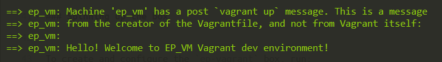

# ep-vagrant

💻 Personal vagrant development environment of Eman Picar but everyone is welcome to use this as referrence for setting up their very own environment!

## Vagrant development box setup


### Installing required software

Before proceeding, the following software should be installed on your host machine:
1. [Git](https://git-scm.com/downloads) - version-control software
2. [Vagrant](https://www.vagrantup.com/docs/installation/) - tool for building and distributing development environments
3. [VirtualBox](https://www.virtualbox.org/wiki/Downloads) - virtualization package allowing installation of guest machines
4. [Cmder](http://cmder.net/#latest-version) - console emulator for Windows (Optional)


### Prepping up

1. Create a `Projects` directory which will contain the source code for the projects

    ```bash
    $ cd C:\Users\<your_username>\workspace
    $ mkdir Projects
    ```

2. Create `GoWorkspace` > `bin|pkg|src` directory inside `Projects` directory. To be used in Golang GOPATH.

    ```bash
    $ cd C:\Users\<your_username>\workspace\Projects
    $ mkdir GoWorkspace
    $ cd GoWorkspace
    $ mkdir bin pkg src
    ```
    
3. Modify vagrant file to use your Projects directory

    ```bash
    30 # Synced folders
    31 # mount Projects directory (absolute path)
    32 ep_vm.vm.synced_folder "C:\Users\<your_username>\workspace\Projects", "/usr/local/src/projects", type: "virtualbox" 
    ```

4. Install _vbguest_ Vagrant plugins (required to mount directories)

    ```bash
    $ vagrant plugin install vagrant-vbguest
    ```


### Spinning up the box

To create and configure the `ep-vagrant` box, run:

```bash
$ cd ep-vagrant
$ vagrant up
```

If guest machine setup is successful, a welcome message should be seen in the console:




### Entering the box's terminal

To SSH into the created box, execute:

```bash
$ vagrant ssh
[vagrant@localhost ~]$ sudo su
[root@localhost vagrant]$ 

[root@localhost vagrant]$ exit
[vagrant@localhost ~]$ exit
Connection to 127.0.0.1 closed.
```


### Customizing the box via Vagrantfile

#### Changing mounted directories

Should you wish to add or remove a mounted directory, edit the **_# Synced folders_** section of the [Vagrantfile](Vagrantfile).

```python
# Synced folders
ep_vm.vm.synced_folder ".", "/vagrant", type: "virtualbox"
```

#### Port forwarding

To access a port on host machine and have all data forwarded to a port on the guest machine, use this configuration under the `# Network` section:

```python
config.vm.network "forwarded_port", guest: 81, host: 8181
```

With the above example, we can access port 81 of guest via port 8181 of the host.


### Important things to note

Golang $GOPATH=/usr/local/src/projects/GoWorkspace. It is preferred if GoWorkspace is available in Projects directory before mounting to avoid further modification

Upon log in via SSH, you will be logged in to the vagrant env using the `vagrant` user. `vagrant` user has limited permissions, so it is advised to switch to `root` user during development.

Make sure that `scripts/install.sh` is executed completely. All necessary packages and dependencies are installed using that script. In case vagrant failed to execute the script due to some error, manually execute the script after logging in to the vagrant env via SSH. 

## Installed development tools after successful ep-vagrant creation
 - [Docker](https://docs.docker.com/engine/install/centos/)
 - [docker-compose](https://docs.docker.com/compose/install/)
 - [Java 11 (openJDK)](https://www.oracle.com/java/technologies/javase-jdk11-downloads.html)
 - [Maven 3.6.3](https://maven.apache.org/)
 - [NodeJS](https://nodejs.org/en/)
 - [Golang 1.14](https://golang.org/)
 - [Python](https://www.python.org/)
 - [Microk8s 1.17/stable](https://microk8s.io/)
 - and other linux helper tools


##### Happy coding!!